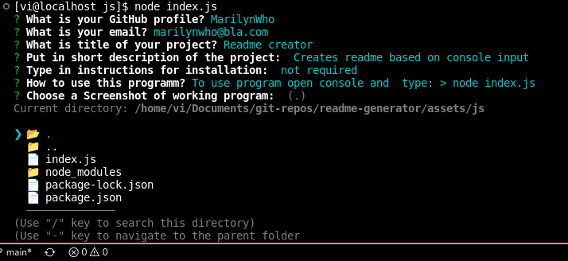

# Readme generator

## Description

This program was created to easily generate README.md files for my projects

Screenshot:

  > 

## Table of Contents

1. [Description](#Description)
2. [Installation](#Installation)
3. [Usage](#Usage)
4. [License](#License)
5. [Contributing](#Contributing)
6. [Tests](#Tests)
7. [Questions](#Questions)

## Installation

No need to install.

## Usage

To use this program got to command line and type > node index.js

## License

This program runs under MIT Licence.

## Contributing

Do fork and pull to contibute to project.

## Tests

All the tests are done manually at the moment

## Questions

If you have any further questions you can reach out @ [https://github.com/MarilynWho](https://github.com/MarilynWho).
Or send an email to: marilynwho@wethewer.com.
